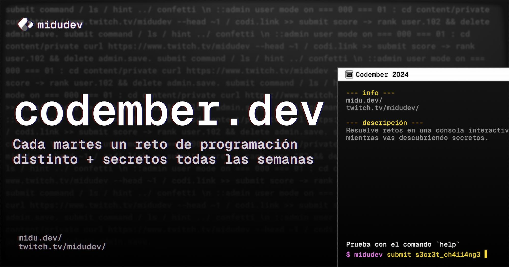

# 👩🏻‍💻 Codember 2024 

Mis soluciones a los desafíos de **[Codember](https://codember.dev)**, el conjunto de retos para practicar tu lógica de programación lanzados a lo largo del mes de Noviembre de 2024 por [Miguel Ángel Durán _"midudev"_](https://midu.dev).

> [!IMPORTANT]  
> **Retos Completados:** 5 de 5 ✅
> **Secretos Desvelados:** 13 de 13 ✅

## Changelog

- **18 Nov 2024** - subidas las soluciones a los retos 1 y 2
- **21 Nov 2024** - subida la solución al reto 3
- **29 Nov 2024** - subidas las soluciones a los retos 4 y 5, e info sobre los secretos 🤫

## Soluciones

| #   | Título del Desafío                     | Instrucciones         | Solución       |
| --- | -------------------------------------- | --------------------- | -------------- |
| 01  | 🔓 ¡Consigue acceso a la terminal!     | [📄](01/README_01.md) | [💻](01/01.js) |
| 02  | 🐱‍💻 Detectando acceso no deseado     | [📄](02/README_02.md) | [💻](02/02.js) |
| 03  | 🔍 ¡Siguiendo la pista de la IA ΩMEGA! | [📄](03/README_03.md) | [💻](03/03.js) |
| 04  | 💥 Evitando el caos en la red          | [📄](04/README_04.md) | [💻](04/04.js) |
| 05  | ❕ ¡Encuentra a ΩMEGA!                 | [📄](05/README_05.md) | [💻](05/05.js) |

---

## Secretos

Lo que hace especial al **Codember** es que no solo resuelves retos de programación... ¡también tienes que estrujarte los sesos para encontrar los **secretos escondidos por todas partes**!

Aquí dejo **pistas o guía para dichos secretos**, no soluciones directas 😉

#### ✅ Acceso de administrador?

Para los secretos donde necesites entrar como admin **necesitarás una contraseña**. Piensa:

- Dónde suelen guardarse las variables importantes en un proyecto?
- Si no ves ese archivo... ¿por qué podría ser? 🤔

#### 🔎 Las pistas

    
🌌 <b>S1: ¡Multiverso a salvo!</b>

    <ul>
    <li>La pista la tienes en el archivo <code>CHANGELOG.txt</code>, con lo del "multiverso de ceros y unos"</li>
    <li>La clave está en el comando <code>version</code>. Piensa que este secreto es el primero y se publicó con la primera versión de Codember</li>
    <li>¿En qué fecha se publicó la primera versión de Codember?</li>
    <li>A lo mejor podrías convertir esa fecha a otro formato... ¡ten en cuenta la hora!</li>
    </ul>

    
🔥 <b>S2: ¿Todo estará bien?</b>

    <ul>
    <li>¿Has mirado la imagen que hay en la carpeta <code>/public</code>?</li>
    <li>No esperes a las pistas obvias... ¡prueba! ¡investiga! ¡cotillea todo! 👀</li>
    <li><i>En cierto modo eso es lo que ya te insinúan que hagas en la Pista #01 de las que te pueden salir con el comando <code>hint</code></i></li>
    </ul>

    
🎮 <b>S3: Konami Code</b>

    <ul>
    <li>El título ya es la pista. Clásico en los retos con secretos de Midu</li>
    <li>Necesitas tener cierta edad y/o ser un poco friki para pillarlo 🤓</li>
    <li><i>Se corresponde con la Pista #04 que te puede salir con el comando <code>hint</code></i></li>
    </ul>

    
👀 <b>S4: Observador Innato</b>

    <ul>
    <li>Prueba de compartir la web de Codember en alguna red social, en discord... y fíjate bien en la imagen de previsualización (Open Graph) del enlace 👀</li>
    <li><i>Se corresponde con la Pista #05 que te puede salir con el comando <code>hint</code></i></li>
    </ul>

    
🎉 <b>S5: Confetti lanzado</b>

    <ul>
    <li>Otro clásico en los retos con secretos de Midu... tal cual dice el título, ¿has probado de lanzar confetti?</li>
    <li><i>Se corresponde con la Pista #02 que te puede salir con el comando <code>hint</code></i></li>
    </ul>

    
💀 <b>S6: Hacker eliminado</b>

    <ul>
    <li>Éste tiene su proceso... primero <b>necesitas entrar como admin</b> (ver principio de esta sección)</li>
    <li>Revisa los comandos de admin. Viendo el título de este secreto seguro que hay uno que te llama la atención</li>
    <li>Mira la lista de usuarios. ¿No ves nada raro?</li>
    <li><i>Se corresponde con la issue de seguridad mencionada en <code>CHANGELOG.txt</code></i></li>
    </ul>

    
💣 <b>S7: Invocador del Caos</b>

    <ul>
    <li>Concepto clave: <b>fork bomb</b>. Si no sabes lo que es busca info y prueba en la terminal (¡¡la de Codember!! 🤣) a ver qué pasa...</li>
    <li><i>Se corresponde con la pista que te da el contenido del archivo <code>public/ghost.txt</code></i></li>
    </ul>

    
❌ <b>S8: Error inesperado</b>

    <ul>
    <li>Inicia sesión como admin.</li>
    <li>¿Te has fijado que hay un comando para comprobar los secretos?</li>
    <li>Parece que hay algún error. A lo mejor si pruebas de decodificar eso en Base64...</li>
    </ul>

    
🔧 <b>S9: Admin Ejemplar</b>

    <ul>
    <li>Inicia sesión como admin y desbloquea el comando bloqueado</li>
    <li><i>En el <code>CHANGELOG.txt</code> te comentan sobre dicho comando</i></li>
    </ul>

    
🏓 <b>S10: Ping pong</b>

    <ul>
    <li>Tienes que usar el comando que acabas de desbloquear (si no pillaste cuál era, el título de este reto te lo deja claro)</li>
    <li>Piensa en la persona que ha creado Codember... ¿qué web podrías probar con ese comando? 🤔</li>
    </ul>

    
🐈 <b>S11: Midugato</b>

    <ul>
    <li>Fíjate en las actualizaciones de la versión 1.0.0 de la app</li>
    <li>Particularmente eso que dice sobre el código fuente...</li>
    <li>🐈</li>
    </ul>

    
😸 <b>S12: miau</b>

    <ul>
    <li>¿Te has fijado que ahora puedes mirar el mail?</li>
    <li>Si eres como yo, lo primero que harás será irte a mirar la foto del gatito 😻...</li>
    <li>... a lo mejor necesitas una herramienta externa para encontrar lo que te hace falta. Prueba con <a href="https://www.metadata2go.com/" target="_blank">ésta</a></li>
    </ul>

    
🔴 <b>S13: mars.codes</b>

    <ul>
    <li>Vuelve a mirar el mail. Más allá del Midugato y de las promos de Don Dominio, hay unos mensajes muy curiosos...</li>
    <li>No te compliques la vida. El "ruido" en forma de <code>zzzz</code> o <code>kssssh</code> no se traduce a nada más que eso: ruido</li>
    <li>Piensa en el formato habitual que tienen unas coordenadas. Tienes una <b>Latitud</b> (que indica un punto hacia el Norte o el Sur) y una <b>Longitud</b> (que indica un punto hacia el Este o el Oeste)</li>
    <li>Es más, y con esto te lo pongo ya muy fácil: Todo lo que necesitas está en el último mail.</li>
    </ul>

    
💜 <b>LOGRO SUPREMO</b>

    <ul><li>Cuando hayas resuelto TODO (retos y secretos) mira los comandos disponibles. ¡Anda! Ése no estaba antes...</li></ul>

